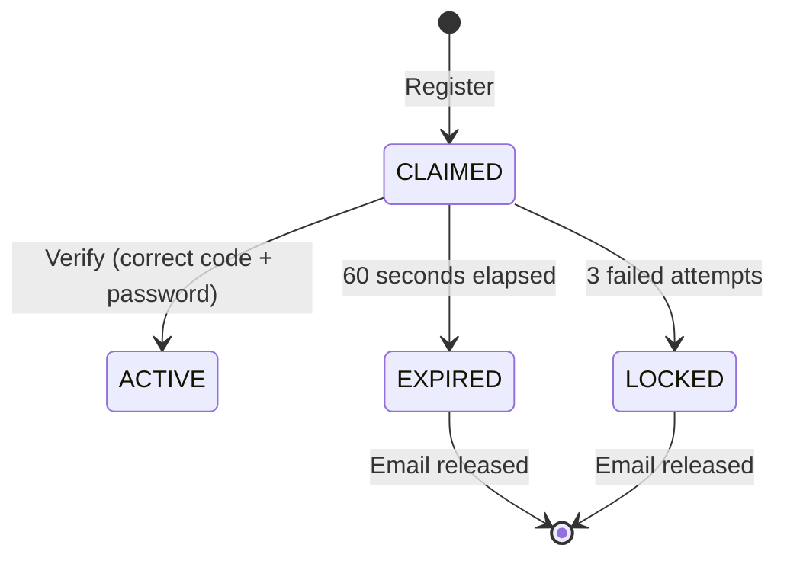

# Story 1.4: README with Architecture Documentation

Status: review

## Story

As a Technical Evaluator,
I want to read the README and understand the architecture before setup instructions,
So that I can evaluate the engineering judgment before running anything.

## Acceptance Criteria

1. **AC1: Architecture-First Structure**
   - **Given** I open the README.md
   - **When** I read from top to bottom
   - **Then** I see Architecture section BEFORE Setup/Installation section
   - **And** the document structure demonstrates engineering judgment

2. **AC2: Identity Claim Dilemma Explanation**
   - **Given** I am reading the README
   - **When** I reach the problem statement section
   - **Then** the "Identity Claim Dilemma" is clearly explained
   - **And** I understand why verification is needed before password storage
   - **And** the Trust State Machine solution is introduced

3. **AC3: Trust State Machine Documentation**
   - **Given** I am reading the Architecture section
   - **When** I examine the state machine
   - **Then** I see a state diagram (ASCII or Mermaid)
   - **And** states are listed: CLAIMED, ACTIVE, EXPIRED, LOCKED
   - **And** transitions are explained with their triggers
   - **And** the 60-second TTL and 3-strike lockout are documented

4. **AC4: Hexagonal Architecture Boundaries**
   - **Given** I am reading the Architecture section
   - **When** I examine the project structure
   - **Then** I see clear domain/adapter/api boundaries explained
   - **And** the "zero framework imports in domain" rule is documented
   - **And** the port/adapter pattern is illustrated

5. **AC5: Single-Command Setup**
   - **Given** I reach the Setup section
   - **When** I read the instructions
   - **Then** setup is a single `docker-compose up` command
   - **And** expected output/behavior is described
   - **And** endpoints are listed with usage examples

## Tasks / Subtasks

- [x] Task 1: Create README structure (AC: 1)
  - [x] 1.1: Create `README.md` with Architecture-First layout
  - [x] 1.2: Add project title and brief description
  - [x] 1.3: Create table of contents with proper section order

- [x] Task 2: Document the Identity Claim Dilemma (AC: 2)
  - [x] 2.1: Write "The Problem" section explaining email verification challenge
  - [x] 2.2: Explain why storing passwords before verification is risky
  - [x] 2.3: Introduce the Trust State Machine as the solution

- [x] Task 3: Document Trust State Machine (AC: 3)
  - [x] 3.1: Create state diagram (ASCII art or Mermaid)
  - [x] 3.2: Document all states: CLAIMED, ACTIVE, EXPIRED, LOCKED
  - [x] 3.3: Document transitions and their triggers
  - [x] 3.4: Explain 60-second TTL for verification window
  - [x] 3.5: Explain 3-strike lockout mechanism

- [x] Task 4: Document Hexagonal Architecture (AC: 4)
  - [x] 4.1: Create project structure diagram
  - [x] 4.2: Explain domain layer purity (zero framework imports)
  - [x] 4.3: Document port interfaces (RegistrationRepository, EmailSender)
  - [x] 4.4: Explain adapter implementations

- [x] Task 5: Write Setup section (AC: 5)
  - [x] 5.1: Document prerequisites (Docker, Docker Compose)
  - [x] 5.2: Write single-command setup instructions
  - [x] 5.3: Document API endpoints with curl examples
  - [x] 5.4: Document how to view verification codes in logs

- [x] Task 6: Add API documentation section (AC: 5)
  - [x] 6.1: Document /v1/register endpoint with request/response
  - [x] 6.2: Document /v1/activate endpoint with request/response
  - [x] 6.3: Include curl examples for the Trust Loop flow
  - [x] 6.4: Reference /docs for interactive testing

## Dev Notes

### README Structure (Architecture-First per FR39)

```markdown
# beefirst

## The Problem: Identity Claim Dilemma
[Problem explanation]

## The Solution: Trust State Machine
[State diagram and explanation]

## Architecture
[Hexagonal boundaries]

## Quick Start
[docker-compose up]

## API Reference
[Endpoints and examples]

## Testing
[How to run tests]

## Project Structure
[Directory layout]
```

### State Diagram (Mermaid)



### State Diagram (ASCII Alternative)

```
                    ┌──────────┐
        Register    │          │
    ───────────────►│ CLAIMED  │
                    │          │
                    └────┬─────┘
                         │
         ┌───────────────┼───────────────┐
         │               │               │
         ▼               ▼               ▼
    ┌─────────┐    ┌─────────┐    ┌─────────┐
    │ EXPIRED │    │ ACTIVE  │    │ LOCKED  │
    │ (60s)   │    │ (done)  │    │ (3x)    │
    └─────────┘    └─────────┘    └─────────┘
```

### Hexagonal Architecture Diagram

```
┌─────────────────────────────────────────────────────┐
│                    API Layer                         │
│              (FastAPI, Pydantic)                    │
└───────────────────────┬─────────────────────────────┘
                        │
                        ▼
┌─────────────────────────────────────────────────────┐
│                  Domain Layer                        │
│    (Pure Python - ZERO framework imports)           │
│  ┌─────────────┐  ┌──────────────────────────┐     │
│  │   Ports     │  │   Registration Service   │     │
│  │ (Protocols) │  │   (Business Logic)       │     │
│  └─────────────┘  └──────────────────────────┘     │
└───────────────────────┬─────────────────────────────┘
                        │
         ┌──────────────┴──────────────┐
         │                             │
         ▼                             ▼
┌─────────────────┐          ┌─────────────────┐
│   PostgreSQL    │          │  Console SMTP   │
│   Repository    │          │    Adapter      │
│   (psycopg3)    │          │   (stdout)      │
└─────────────────┘          └─────────────────┘
```

### Trust Loop Flow Example

```bash
# Step 1: Register
curl -X POST http://localhost:8000/v1/register \
  -H "Content-Type: application/json" \
  -d '{"email": "user@example.com", "password": "secure123"}'

# Response: {"message": "Verification code sent", "expires_in_seconds": 60}

# Step 2: Check logs for code
docker-compose logs api | grep VERIFICATION
# Output: [VERIFICATION] Email: user@example.com Code: 1234

# Step 3: Activate (within 60 seconds)
curl -X POST http://localhost:8000/v1/activate \
  -u "user@example.com:secure123" \
  -H "Content-Type: application/json" \
  -d '{"code": "1234"}'

# Response: {"message": "Account activated", "email": "user@example.com"}
```

### Previous Story Learnings

**From Story 1.1-1.3:**
- Hexagonal Architecture scaffold complete
- Docker Compose with PostgreSQL 16 + healthchecks
- FastAPI with OpenAPI docs at `/docs`
- Endpoints stubbed (501) until Epic 2/3

### Critical Constraints

1. **FR39**: README must present architecture BEFORE setup instructions
2. Architecture documentation should explain "why" not just "what"
3. Setup must be single command: `docker-compose up`
4. No complex prerequisites beyond Docker

### Testing Approach

This story is documentation-only. Verification is manual:
1. Read README.md top-to-bottom
2. Verify Architecture section appears before Setup
3. Verify state diagram is present and correct
4. Verify curl examples work with running system

### References

- [Source: prd/functional-requirements.md#FR39]
- [Source: architecture/core-architectural-decisions.md]
- [Source: product-brief.md - Identity Claim Dilemma]

## Dev Agent Record

### Agent Model Used

Claude Opus 4.5 (claude-opus-4-5-20251101)

### Debug Log References

N/A

### Completion Notes List

- All 6 tasks (19 subtasks) completed
- README follows Architecture-First layout per FR39
- Identity Claim Dilemma clearly explained with risks
- Trust State Machine documented with ASCII diagram and state/transition tables
- Hexagonal Architecture explained with layer diagram
- Quick Start with single `docker-compose up` command
- Complete API Reference with curl examples for Trust Loop
- Project structure and configuration documented

### File List

- README.md (created)
